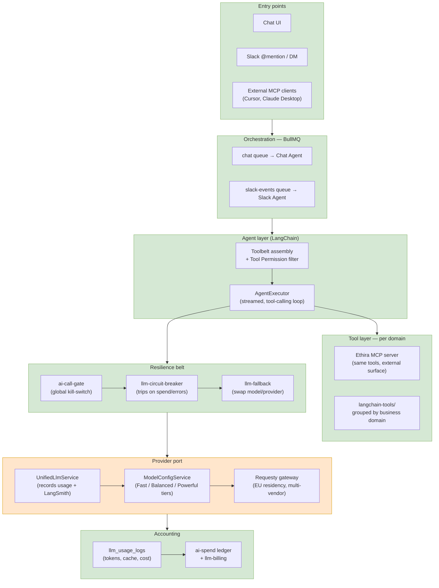
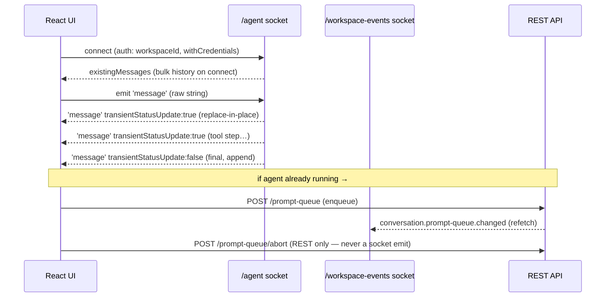
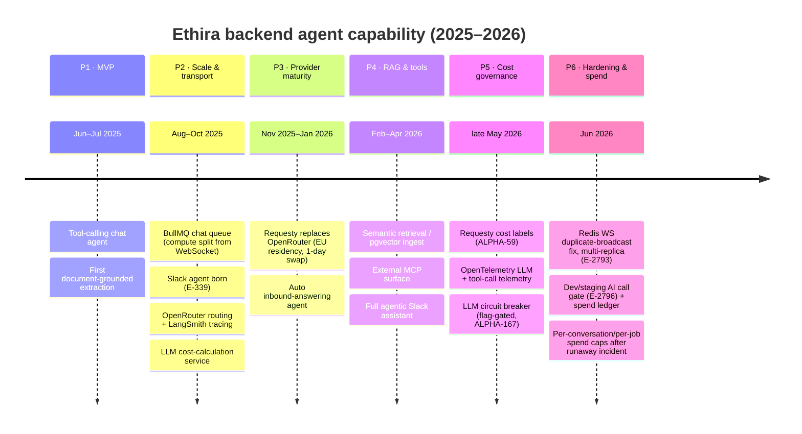
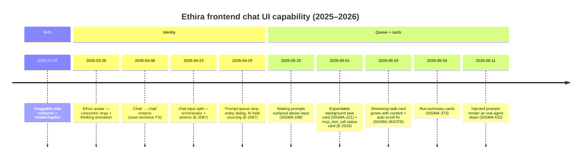

# Ethira Agentic Architecture — Responsibilities & Portable Learnings

> How the AI/agent stack is wired, who owns what, and which patterns are worth carrying to the next project.

Ethira embeds LLM agents inside a multi-tenant SaaS. The design separates **five concerns** into distinct layers: a **provider port** (one way to call any model), a **resilience belt** (gate, breaker, fallback), a **tool model** (per-domain functions filtered by permission), an **orchestration layer** (agents running on background queues), and an **accounting layer** (every call logged for cost). The whole thing is built so that no business service ever talks to OpenAI directly — it goes through ports, which is what makes cost control, model swapping, and data-residency compliance possible after the fact.

_Document stats: 6,898 words · 47,467 characters · ~35 min read._

---

## Architecture — the five layers



**Legend:** 🟩 existing layer · 🟧 migrated (OpenRouter → Requesty) · 🟦 candidate for next project

---

## The request path, end to end

```js
// A message arrives (UI or Slack) — never handled inline
enqueue(message) + BullMQ chat/slack queue

// WHY: Queue = retryability, abort, back-pressure, no HTTP timeout on long tool loops
worker.process(job):
    toolbelt = assembleTools(workspace, user, conversation)
    // WHAT: Toolbelt filtered by Tool Permission (Action+Subject) — user only sees what they may invoke

    if not aiCallGate.areAiCallsAllowed(): throw          // kill-switch / dev gate
    model = modelConfig.getModelForUseCase(useCase, tier) // pick cheapest viable tier

    executor = langchain.getAgentExecutor(toolbelt, history, callback, temp, model, {
      workspaceId, applicationContext, conversationId      // tracking ctx
    })
    // DEPS: circuit-breaker + fallback wrap the call; UnifiedLlmService logs tokens/cost
    await executor.stream(message)  // tokens stream back to UI as agent steps
```

---

## What library is actually running the agent?

The runtime is classic **LangChain**: `createToolCallingAgent` + `AgentExecutor` from `langchain/agents`, on top of `ChatOpenAI` from `@langchain/openai`. **LangGraph is installed but not used** — `@langchain/langgraph` and `langgraph-checkpoint-postgres` are in package.json, but there is zero `StateGraph` / `createReactAgent` / checkpoint usage in `api/src` (see the build-order section for the full tried-and-abandoned story). Conversation memory is not LangGraph-persisted; it's re-loaded from Postgres each turn and windowed by hand. Tracing is **LangSmith** (flag-gated). The same `getAgentExecutor` builder serves every agent — Chat, Slack, structured field extraction, document-editing websocket, domain analysis.

### `getLLM()` — building the traced, gated, cost-labeled model `[CORE]`

**WHAT:** Constructs one `ChatOpenAI` instance per call with all cross-cutting concerns attached before a single token flows.

```js
pricing.validateModelPricing(model)                 // refuse models with no price table
{baseURL, apiKey, actualModel} = getModelConfig(model)  // Requesty vs direct OpenAI
//   normalizeModelForRequesty: 'gpt-5-mini' → 'openai/gpt-4o-mini', etc.

return new ChatOpenAI({
  model: actualModel, apiKey, temperature,
  timeout, maxRetries,                              // resilience at the SDK layer
  configuration: { baseURL, defaultHeaders: requestyHeaders },
  modelKwargs: {
    usage: { include: true },                       // Requesty returns real cost on the wire
    requesty: buildRequestyCostLabels({workspaceId, applicationContext, userId}),
    prompt_cache_key: `${context}-${workspace}-${conversation}`,  // CACHE
    prompt_cache_retention: '24h',
  },
  callbacks: [langSmithCallbacks, trackingCallbacks],
  tags: ['langchain', 'model:X', 'requesty', ...workspaceTags],
  metadata: { workspaceId, applicationContext, conversationId, ... },
})
```

**The two callback chains (where cost + tracing live):**
- `trackingCallbacks.handleLLMEnd` → reads token usage, extracts `cachedInputTokens` (camel + snake case), takes wire `cost` from Requesty OR computes via `pricingService` (caching discount + provider markup), then `unifiedLlmService.recordUsage(...)` → `llm_usage_logs`
- `handleLLMError` → records a failed-call row (0 tokens + errorMessage) so failures are still metered
- `langSmithCallbacks.handleLLMStart` → attaches model/provider/promptCount metadata to the trace
- CLS job metadata is merged in — a call made inside a BullMQ job carries its job context into the trace

### `getAgentExecutor()` — the tool-calling loop `[CORE]`

```js
llm = await getLLM(model ?? 'openai/gpt-5-mini', temp ?? 1, tracking)
sortedTools = tools.sort(byName)          // stable order = stable prompt prefix = better cache hits
llmWithTools = llm.bindTools(sortedTools)

// escape { } in history so ChatPromptTemplate doesn't treat them as vars
{system, rest} = collapseSystemMessages(['You are a helpful assistant', ...history])
prompt = ChatPromptTemplate.fromMessages([
  'system', ...rest, ['human', '{input}'], ['placeholder', '{agent_scratchpad}']
])

agent = createToolCallingAgent({ llm: llmWithTools, tools, prompt })
executor = new AgentExecutor({
  agent, tools, returnIntermediateSteps: true, maxIterations,    // loop guard
  callbacks: { handleAgentAction, handleToolStart, handleToolEnd, handleAgentEnd }
  // → streamed to UI as real "agent steps", not fake user messages
})
return executor.withConfig({ callbacks: [otelToolTelemetry] })   // OTel spans per tool
```

**Why each detail matters:**
- `maxIterations` = the hard loop guard; without it a confused agent loops tools forever burning tokens
- `agent_scratchpad` placeholder is where ReAct intermediate steps accumulate across iterations
- Alphabetical tool sort is a quiet cost win — deterministic prompt prefix improves prompt-cache hit rate

### A tool — thin adapter over a domain service `[TOOL]`

```js
schema = z.object({ id: z.string().uuid() })   // Zod = the model's input contract
export const getResearchTool = (researchService, workspaceId) => tool(
  async (input) => {
    const r = await researchService.findById(input.id, workspaceId)  // just calls the service
    return JSON.stringify({ id: r.id, name: r.name, ... })           // returns a JSON string
  },
  { name: 'get_research', description: '...inputs/errors...', schema, responseFormat: 'json' }
)
```

**The rule that keeps this clean (`api-first-headless-consumers`):**
- A tool **never** contains business logic — controller, agent tool, and MCP handler are all thin adapters over the same service method
- `workspaceId` is closed over at construction, not passed by the model — the model literally cannot reach another tenant's data
- Errors are caught and returned as structured JSON (`{success: false, error}`) so the model can reason about failure instead of crashing the loop
- The description is the prompt — inputs + error codes documented for the model, governed by the `api-prompts` rule

### MCP bridge — external tools become LangChain tools `[INTEROP]`

**WHAT:** `jsonSchemaToZod(entry.inputSchema)` converts a remote MCP tool's JSON-Schema into a Zod schema, then wraps it in the same `tool()` primitive — so an external MCP server's tools join the toolbelt transparently.

**Safety built into the bridge:**
- Only CONNECTED / DEGRADED connections are usable; dead connections are filtered out
- Write actions return `requiresConfirmation:true` instead of executing — human-in-the-loop gate on mutations
- Tool names are namespaced to avoid collisions with native tools

---

## Asynchronous conversation — WebSocket + Queue decoded

Chat is fully asynchronous: transport and compute **are split**. The WebSocket only carries messages; the agent runs in a BullMQ worker. So the long tool-calling loop is *not* tied to the socket's lifetime — if the client disconnects mid-answer, the job keeps running, results persist to Postgres, and the client replays on reconnect.

```mermaid
sequenceDiagram
    participant Client
    participant WS as AgentWebsocket (Socket.IO)
    participant Q as ConversationPromptQueue (BullMQ)
    participant W as message-processor (worker)

    Client->>WS: connect (workspaceId) + withCredentials
    Client->>WS: send prompt
    WS->>Q: persist ChatPromptQueueItem + enqueue (carries socketConnectionId)
    Q->>W: per-conversation sequencing (transient)
    W-->>WS: agent step 1
    W-->>WS: window history, assemble toolbelt, run AgentExecutor
    WS-->>Client: stream agent steps
    W->>Q: end (job persists, results in DB)
    WS-->>Client: final message + persist to DB
    Note over Client,W: on disconnect mid-answer, job keeps running; client replays on reconnect
```

### Why split transport from compute `[PATTERN]` — what each piece buys

- **Socket.IO + Redis adapter** (`redis-io.adapter.ts`) — sockets and emits route across API replicas; what made scaling to 2+ replicas (E-2793) safe
- **ConversationPromptQueue** — a persisted `ChatPromptQueueItem` per prompt gives per-conversation sequencing (no two prompts racing the same thread) and durability (job survives a dropped socket)
- **socketConnectionId in job data** — the worker knows which room to stream back to, even though it runs on a different process than the socket
- **Rooms** (`websocket-room.service`) scope broadcasts to a conversation/workspace; **typed envelopes** (`to-ws-message.utils`, `tool-calling.messages`) carry agent steps
- **Abort** — `chat-job-short` cancels the in-flight job on an explicit user stop (REST `POST /prompt-queue/abort`); the `stepCallback` feeds the live stream. **NOT fired on socket disconnect** — see caveat below
- Separate gateways for separate agents: `agent.websocket` (chat), `document-editing-agent.websocket` (doc editing), plus `workspace-events` / `policy-bundle-invalidation` for push

### The cleanup obligation the split creates — bridge disconnect → abort

Splitting transport from compute buys disconnect-durability — but it also **severs the socket's natural "client left → stop work" signal**. In a single-process request/response model a dropped connection cancels the work for free. Once compute lives in a worker, that free cancellation is gone and you must re-create it explicitly.

- An abort authority (`AbortController` + a `requestAbort` API, signal checked each iteration/tool boundary) is the mechanism that turns "client gone" back into "stop work."
- A spend cap is a backstop, not an abort: a run that stays under the cap still bills in full, so the cap alone does not satisfy the cleanup obligation.
- **Portable rule:** the transport/compute split is good, but it creates a cleanup obligation — on `disconnect`, call the same abort authority the explicit-stop path uses, so a dropped socket cannot leave a job billing to completion.

---

## Component responsibilities

### UnifiedLlmService `[PROVIDER PORT]`
**WHY:** One choke point so every call is logged, traced, and swappable — no service calls OpenAI SDK directly. **WHAT:** Wraps both direct-completion and LangChain-executor paths; writes `llm_usage_logs`, enriches LangSmith tags with `workspaceId + ApplicationContext`. **DEPS:** OpenAIService / LangChainService → Requesty gateway; ApplicationContext enum.
- The single port is what made the OpenRouter → Requesty migration a config change, not a rewrite
- ApplicationContext tagging is what makes per-feature cost + cache analysis possible later

### ModelConfigService — Fast / Balanced / Powerful `[COST ROUTING]`
**WHY:** Most calls don't need a frontier model; default to cheap, escalate only when the task demands it. **WHAT:** `getModelForUseCase(useCase, tier)` → concrete model string. Fast €0.10–0.25/1M, Balanced €1.25–3/1M, Powerful €15–60/1M. **DEPS:** Requesty model catalogue; LiteLLM price table refreshed periodically.
- Tier is a property of the use case, not hardcoded per call site — one place to retune cost vs quality
- Commit history shows repeated "route X through cheaper policy" instead of `gpt-5-mini` — escalation is reversible and audited

### ai-call-gate · llm-circuit-breaker · llm-fallback `[RESILIENCE BELT]`
**WHY:** LLM spend is unbounded by default; three independent breakers at different scopes. **WHAT:** Gate = global on/off (and dev/staging blocked-by-default, 10-min enable). Breaker = flag-gated, trips on spend/error rate. Fallback = swap model/provider on failure. **DEPS:** Redis (gate state, MCP rate-limit), feature flags, per-conversation kill-switch.

**Scopes — keep them separate:**
- Per-conversation kill-switch (E-2814) stops a runaway single chat
- Breaker protects the whole workspace/provider
- Dev gate stops accidental spend in non-prod — biggest cheap win

### Tool / Toolbelt / Agent / Tool Permission `[TOOL MODEL]`
**WHY:** Agents need capabilities, but multi-tenant means a user must never invoke a tool they lack rights for. **WHAT:** Tool = named fn + Zod schema returning JSON. Toolbelt = the set assembled for (workspace, user, conversation). Tool Permission = Tool→(Action, Subject) used to filter the belt. **DEPS:** `langchain-tools/` grouped by domain; same tools re-exposed via the Ethira MCP server.
- Internal agent (LangChain) and external MCP server share the tool layer — write once
- Permission filtering happens at toolbelt assembly, before the model ever sees a tool
- MCP AI-tool calls are rate-limited via Redis (E-2793)

### Chat Agent vs Slack Agent on BullMQ `[ORCHESTRATION]`
**WHY:** Tool-calling loops are long and bursty — must not run in the request thread. **WHAT:** Same Agent core, two queues (chat, slack-events). Jobs are abortable, retryable, and survive restarts. **DEPS:** BullMQ + Redis; CLS workspace context propagated into eager jobs.

**Hard-won queue lessons (from commits):**
- Fail fast on non-retryable errors — don't flood the DLQ (E-2848)
- Jitter retry backoff to break deadlock lockstep (E-2849)
- Guard against stale jobs spamming errors after restart (SIGMA-402)
- Guard eager-onboarding auto-start against infinite retry loops
- Render injected prompts as real agent steps, not fake user messages (SIGMA-432) — transparency

---

## Agent roster — responsibility · tools · permissions

Eight distinct agents, but only **two are user-facing tool-calling AgentExecutors** (chat + doc-edit). The rest are narrow, background, single-purpose extractors — most don't even use the ReAct loop. Toolbelt size is the tell. **"Firecrawl agent" does not exist** — Firecrawl is shared infra (`firecrawl-provider.ts → url-extraction.service.ts`), surfaced as the `add_document_from_url` tool — a reminder that a provider behind one tool is not an agent.

| Agent | Responsibility | Model / tier | Toolbelt | Permissions |
|---|---|---|---|---|
| **Chat agent**<br/>`agent.websocket.ts` + `chat-message.processor.ts` | General workspace assistant across every business domain | `policy/chat` · BALANCED | ~150 tools, dynamically assembled via `buildTools()`. Belt grows by context | [RBAC] `filterToolsByPermissions` at toolbelt assembly |
| **Doc-editing agent**<br/>`document-editing-agent.websocket.ts` | Real-time Q&A + edits grounded on ONE document | `policy/complex-analysis` · POWERFUL · temp 1 | 3 static tools incl. a document-write tool | WS JWT + workspace membership guard; mutating tools gated action-level at write bind time |
| **Slack agent**<br/>`agents/ethira-slack/` | Natural-language requests from Slack across every business domain | `policy/slack-agent` · BALANCED + fallback | ~100+ tools via `buildToolbelt()`. Largest belt | [RBAC] `filterToolsByPermissions`; MCP-client gated permission |
| **Structured data-retrieval**<br/>`agents/*-data-retrieval.agent.ts` | Per-field LLM extraction across docs to fill a known set of profile fields | `policy/chat` · BALANCED · temp 0 | No AgentExecutor — direct structured completion, per-field schema, no tools | None — programmatic |
| **Structured data-extraction**<br/>`*-data-extraction.agent.ts` | Searches docs for structured fields, returns JSON | service default · BALANCED | 2 static tools: `fetch_document_summaries`, `fetch_document_content` | None — background |
| **Reminder-extraction**<br/>`agents/reminder-extraction.agent.ts` | Parses a document → typed deadline reminders | `policy/chat` · BALANCED · temp 0 | No tools — structured output. Also exposed AS a tool (`extract_reminders`) | None |
| **Inbound-answering**<br/>`*-agent-answering.service.ts` | Answers inbound questions via `file_search` over a public-doc vector store | `gpt-5.1` direct · OpenAI Responses | 1 built-in tool: OpenAI `file_search` | None — access gated upstream |
| **Workspace-events WS**<br/>`websocket/workspace-events.websocket.ts` | Pure event relay — NOT an agent (no LLM/tool) | — | — | WS guards |

### Patterns worth stealing

- **Belt size tracks agent breadth.** Two big open-ended belts (chat ~150, slack ~100+) vs narrow agents with 0–3 tools. Narrow background extractors skip the ReAct loop entirely — direct structured completion is cheaper and more deterministic (temp 0).
- **Agent-loop vs direct-completion is a design axis, not an accident.** Two structured-extraction agents look like duplicates but are deliberate forks on task shape. The retrieval variant uses direct `getLLM + withStructuredOutput`, field-by-field, no tools, temp 0 — deterministic batch fill of a known field set from given docs. The extraction variant uses a full `AgentExecutor + doc-fetch tools`, free-form output — an open task where the model must decide which documents to pull. **Rule:** reach for an executor loop only when the model needs to decide what to fetch next; if inputs are known up-front and the output is a fixed schema, a single structured completion is cheaper, deterministic, and can't loop. Caveat: the two code paths share no abstraction — a real drift risk. Worth a shared interface once a third variant appears (Rule of Three).
- **One tool definition, many surfaces.** `extract_reminders` is both a standalone agent AND a chat tool; tools are thin adapters over the same services used by controllers/MCP.
- **RBAC where it matters — and an action-level write gate is the control that matters most.** Multi-tenant open belts filter by `(Action, Subject)`; pre-scoped/background agents skip it, which is fine for READ-only or programmatic agents. The control worth insisting on: any tool that mutates tenant data passes an action-level write permission check at the moment it's bound. Why it's load-bearing — it's the difference between "the agent can only touch this one document" (scoping) and "only a user entitled to edit this document can make the agent touch it" (authorization). Membership limits what an agent can do; it says nothing about what they may invoke.

---

## Frontend ↔ agent — how the UI drives the system

The frontend talks to agents over **two separate Socket.IO connections** plus a thin REST surface. The surprising parts: the chat message payload is a **raw string** (no envelope), streaming uses a single `message` event with an **in-place transient-replace** trick (not token append), and **abort is REST-only** — never a socket emit. State is plain React `useState<Message[]>`, no Redux/Zustand.



| Concern | Mechanism | Detail |
|---|---|---|
| Two sockets | `/agent` (or `/document`) + `/workspace-events` | chat-socket = per-conversation; workspace-events = ref-counted singleton per workspace |
| Auth | handshake `auth: {workspaceId,…} + withCredentials` | cookie-session auth, NOT JWT bearer; context ids ride in the handshake |
| Doc-edit vs chat | namespace switch only | `documentId ? '/document' : '/agent'` — same protocol |
| Send message | `emit 'message'` = raw string | no envelope; if agent busy → REST enqueue instead of emit |
| Streaming render | single `message` event + `transientStatusUpdate` flag | `true` = replace last transient row in-place; `false` = swap for permanent append |
| History load | `existingMessages` / `olderMessages` over socket | history is WS, not REST |
| Abort | REST only `POST /prompt-queue/abort` | no socket emit for cancel; also `cancelItem (DELETE)` + clearQueue |
| Queue | `conversation.prompt-queue` | per-conversation prompt queue |

- **Two sockets, two jobs.** `/agent` is per-conversation; `/workspace-events` is a workspace-wide bus opened once per workspace and shared via reference-counting. Workspace fan-out would otherwise duplicate onto every open chat socket.
- **Abort is a server fact, not a socket whim.** Cancelling is a REST call because the agent runs in a BullMQ worker, not the socket. If abort were a socket message and the socket dropped, the cancel would be lost and the job would keep burning tokens.
- **Busy → enqueue, idle → emit.** The frontend itself checks if the agent is running for this conversation. Back-pressure starts on the client — you can't fire ten concurrent runs by mashing send.

### Chat UI components + the card protocol

One `<Chat>` component (`app/src/components/chat/chat.tsx`) serves **three surfaces** — resizable panel, 540px slide-over drawer, full page — switched by props, not forks. The clever part is the **card protocol**: the agent stays text-only and emits **fenced markdown code blocks** with special language classes; the frontend swaps each for a real React component. Agent "draws UI" without knowing React.

| Fenced class (from agent) | Renders as | Behaviour |
|---|---|---|
| `language-entity-card` | `<EntityCard>` | JSON body → structured entity tile |
| `language-status-card` | `<LiveStatusCard>` | **self-updating** — polls `useLiveCardStatus()`; keeps updating after stream ends |
| `language-summary-card` | `<SummaryCard>` | summary block |
| `language-table-card` | `<TableCard>` | tabular layout |

**Component tree:**

```
Chat (chat.tsx) — 3 mounts: ResizableLayout panel · Sheet drawer (540px) · /agent full page
├─ ChatEmptyView | ChatFullView
├─ ChatMessages
│  ├─ BackgroundTaskCard        (grouped task blocks)
│  └─ MessageItem
│     ├─ UserMessage + MarkdownRenderer
│     └─ BotMessage → header(+ThinkingDots) + body + MarkdownRenderer
│                      └─ card dispatch: EntityCard | LiveStatusCard | SummaryCard | TableCard
└─ ChatInput
   ├─ PromptQueueStrip / PromptQueueModal
   ├─ Textarea
   └─ ChatInputActionsRow + ImproveDraftButton + SendOrStopButton
```

---

## Consensus ensemble — fan-out + mediator for high-stakes extraction

The cost story so far is "default cheap, escalate only when forced." **Consensus is the deliberate exception — the one place Ethira spends MORE on purpose.** When an inbound document must be parsed into a clean item list, `ModelConfigService.getConsensusEnsemble()` fans the same extraction out to **three diverse models in parallel**, then a **cheap mediator** synthesises them into one deduped, ordered list. Why pay 4 calls for one output? Because a single model silently drops items — and a missed item in an externally-read output is an undetectable error. Diverse models miss different items, so union recovers coverage no single model achieves.

**`getConsensusEnsemble()` — parallel fan-out, mediated synthesis `[ACCURACY ROUTING]`.** **WHAT:** 3 ensemble members extract in parallel (`Promise.all`); a 4th mediator LLM consolidates all 3 raw outputs into one list. Used in BOTH extraction and review stages of the flow. **WHY:** Structured-extraction misses are uncorrelated across models — union + dedupe recovers coverage; a dropped item is read externally, so it's a costly, hard-to-retract error.

```js
// silent fallback chain:
if (mediator fails) return firstParseable(a, b, c)   // warn-logged, NOT surfaced
if (all 3 fail)     throw 'All three AI models failed... cannot consolidate'
```

**The non-obvious bits:**
- **The mediator is the CHEAP part.** The cost is the 3 parallel extractions; consolidation runs on a BALANCED model (`gpt-5-mini`). So "consensus" ≈ 3× extraction + 1 cheap merge, not 3× frontier reasoning.
- **It synthesises, it doesn't vote.** The mediator reads all 3 JSON outputs and writes one unified list — no majority count, no confidence weighting.
- **Disagreement handling is a design choice.** If the mediator throws, the code returns the first raw response that parses. **Principle:** for a high-stakes flow, "the N models disagreed" is a signal worth surfacing to a reviewer rather than collapsing silently.
- **Scoped to ONE flow.** Only the high-stakes extraction/review path uses it — every other path stays single-model. The expensive pattern is quarantined to where misses are costly + low-volume.

**Portable rule — when is N-model consensus worth the multiplier?** The inverse of tier-routing: spend more, not less. **Use consensus + cheap mediator when all three hold:** (1) the task is **structured extraction/parsing** where a miss is silent and uncorrelated; (2) the output is **externally-read or hard-to-retract** (a customer sees it); (3) volume is **low** (one-off document intake, not chat).

---

## Cost mechanisms — the full toolbox

| Mechanism | Scope | Detail |
|---|---|---|
| Prompt-cache hit monitoring | ApplicationContext | tracks hit % |
| Token-capping context | per conversation | caps `policy/chat` context by tokens (E-2815) |
| RSS-first before LLM | per feature | LLM bootstraps the feed once, then token-free HTTP polls forever (E-2826) — see drill below |
| Cheaper-policy routing | per call site | route sanitization/eval off frontier models (ALPHA-150) |
| Per-conversation kill-switch | one chat | stops a single runaway loop (E-2814) |
| Circuit breaker | workspace/provider | halts cascading spend on error spikes |
| Dev/staging AI gate | environment | blocks all non-prod LLM spend by default |
| ai-spend ledger + llm-billing | org | not prevention — visibility + chargeback |

**Cost verdict:** every mechanism above pushes spend down — except one. The consensus ensemble is the deliberate counterweight: it spends ~4× on a narrow, high-stakes extraction flow because a silent miss is worse than the cost. The honest takeaway is two-directional — **default to the cheapest viable tier everywhere, then make a short, explicit list of flows where accuracy is worth a multiplier and quarantine the expensive pattern to exactly those.** The failure mode is the opposite drift: a frontier model creeps into a high-volume path nobody re-routed (which is what E-2396's ~40-file `getModelForUseCase` retrofit had to undo).

### RSS-first drill-down — bootstrap the pipe once, then poll free

```
DISCOVER (one LLM call per source, ever)
  + persist feed URL on the subscription

ACTIVE                                // every subsequent poll — ZERO tokens
  + HTTP conditional GET (ETag / If-None-Match)
  304 Not Modified → done
  200 → feedParserRegistry.parse()    // deterministic RSS/Atom/JSON
  10 consecutive failures → status = FALLBACK_LLM

FALLBACK_LLM                          // source has no machine-readable feed at all
  + early-return on every run; legacy LLM check takes over
```

**Why it generalises:**
- **The LLM shifts from "answer every time" to "bootstrap the pipe once."** One discovery call per source ever, then free HTTP polls forever — not "LLM as per-call fallback."
- **Degradation is explicit + bounded.** No feed, or `MAX_CONSECUTIVE_FAILURES_BEFORE_LLM = 10`, drops a source to the LLM path — the expensive route is the documented exception, never the default.
- **Portable to any monitoring/ingest task** with a structured source: prices, news, status, filings. Discover the feed/API once with the LLM, then parse deterministically.

---

## Progressive loading — are we even doing it? Honest answer

Not in the classic sense (no streamed context expansion or rolling summarisation). There is no LangGraph state.

| Capability | Status | Detail |
|---|---|---|
| Prompt cache | ✅ YES | `prompt_cache_key` per (context, workspace, conversation), 24h retention — cuts re-send cost |
| Self-hosted embeddings / pgvector | ❌ NO | Relies entirely on OpenAI's hosted vector store — no own embedding pipeline into chat context |
| Rolling summarisation of history | ❌ NO | History truncated/windowed, not summarised — old turns dropped with only a notice, content lost. **The real trigger to add summarisation is not session length — it's when the omission notice's "nothing important was dropped" promise starts being false** |
| LangGraph stateful/graph flows | ❌ NO (tried + abandoned) | Built for the onboarding agent Jul 2025, Postgres checkpointer never enabled, deleted after 17 days; replaced by an explicit `eager_run` domain state machine |

**Windowing lesson worth stealing:** An omission notice should state *what was dropped*, not *promise nothing important was*. Ethira's notice claims "the current state is fully captured below" — a guarantee the windower cannot actually make (it's only true when the preamble re-injects that state). A truthful notice ("N earlier turns omitted") ages safely; a reassuring one becomes a load-bearing lie the moment the conversation leaves the rails the preamble assumes.

The mechanism itself is **convergent and safe by construction** (greedy newest-first turn-keeping + a truncate-the-longest safety loop that can't spin; `budgets@` returns `''`). But pure truncation loses content silently — a mid-message hard-truncate can sever a tool-result JSON mid-token, and dropped turns leave only a notice, never a summary.

---

## Economic-safety review gate — guarding against cost runaway

The control that makes a whole class of bug unshippable. Three artifacts:

| Layer | File | Role |
|---|---|---|
| **Rule** | `ai-workflow-safety.mdc` | Auto-applied while editing `processors/**`, `services/ai/**`, `langchain-tools/**`, `telemetry/**` — the non-negotiables in front of the author as they type |
| **Skill** | `ai-workflow-skill/SKILL.md` | The actionable half — loop-guard template, token-budget truncation, per-conversation kill-switch, CLS-propagation checklist, test templates |
| **Specialist agent** | `ai-workflow-specialist.md` | Deep review pass — a **read-only** Sonnet subagent (Read/Grep/Glob only) the main coding agent must dispatch when a diff touches LLM paths |

**`ai-workflow-specialist` — the required checks `[GOVERNANCE]`. How the gate operates:**
- **Trigger** — the main agent dispatches it on any change to an LLM call, agent/tool loop, prompt/history assembly, a BullMQ processor/scheduler driving LLM work, retry/concurrency config, or cost telemetry.
- **The checks**, each ✓/⚠/✗ with a `path:line` citation: loop-termination guard (hard ceiling + convergence check); context/token bound (token budget, not message count); cost circuit-breaker (per-conversation/per-job ceiling that hard-stops); cost attribution (`workspaceId + applicationContext + CLS` context in jobs); telemetry truth (cumulative counter read with `increase()`/`rate()`, never raw `sum()`); amplification (retries don't re-bill; concurrency won't fan out); prompt copy paired with a code change.

**Review gate vs eval harness — complementary, not interchangeable.** A human/AI review gate catches what a smart reviewer spots pre-merge — cost blowup, a dangerous new capability, a missing loop guard. It's judgment-driven and doesn't scale to regression: nobody re-runs every flow by hand on each merge. An eval harness catches exactly what review can't — silent output-quality drift across many flows after a model bump or prompt edit. Ethira built the former (E-2819, cost-scoped) and not the latter, consistent with its incident history: **cost got a gate because cost burned them; quality never visibly broke, so it never got one.** Steal the review gate, but don't mistake it for the eval you still owe.

---

## Evolution — backend agent track (git-verified)

Repo birth **2025-05-07 → 2026-06-16** (~13.5 months). The agentic backend grew in six phases. Headline: **working agent shipped in week 5 with zero queue infra**; queue, observability, and cost governance were all earned later — cost governance dangerously late.



| Phase · dates | Overarching capability earned | Why (the forcing problem) |
|---|---|---|
| **P1 · MVP** · Jun–Jul 2025 | A working tool-calling chat agent over WebSocket, plus the first document-grounded extraction and analysis tools | Stand up the product's first AI assistant and prove the thin tool-adapter pattern |
| **P2 · Scale & transport** · Aug–Oct 2025 | Compute split from the socket onto a durable queue; a second channel (Slack); first provider gateway with tracing, model tiering, fallback, and cost calculation | Long tool loops outgrew the request thread; ordering/durability and observability started to hurt |
| **P3 · Provider maturity** · Nov 2025–Jan 2026 | EU-resident LLM routing through a single gateway; first autonomous inbound-document answering | Data residency, and removing manual document-handling effort |
| **P4 · RAG & tools** · Feb–Apr 2026 | Semantic retrieval over workspace docs (embeddings → vector tool → hosted pgvector ingest); an external MCP surface; a full agentic Slack assistant | Keyword matching was too imprecise; capabilities needed to reach external clients and the full toolbelt |
| **P5 · Cost governance** · late May 2026 | Centralised model selection, end-to-end cost-attribution labels, GenAI telemetry, and a circuit breaker | Hardcoded models were unsafe to change; spend was unattributable and provider outages cascaded |
| **P6 · Hardening & spend** · Jun 2026 | Multi-replica safety, a dev/staging AI gate + spend ledger, and — after a production runaway — per-conversation/per-job spend caps, token-budget windowing, and loop-exit guards | Scaling double-delivered events; non-prod ran unmetered; **a runaway-spend incident with no agent exit condition forced hard caps** |

### The LangGraph detour (the cautionary tale)

On **2025-07-18** (Lucas de Araújo, commit `a99068d13`) all 2,102 lines were swept: *"This refactor eliminates the onboarding agent functionality from the codebase."*

**What replaced it is the actual lesson:** the onboarding capability came back months later as **"eager onboarding"** — an explicit domain state machine they own (an `eager_run` entity with an `awaiting_documents + approval` status lifecycle, driven by BullMQ), using the plain `getAgentExecutor` only for the LLM steps. SIGMA-415's title says it all: "advance eager onboarding past `awaiting_documents` reliably" — explicit, debuggable, resumable states the opaque graph checkpointer never delivered.

**Portable rule:** don't reach for in-framework graph/checkpoint state speculatively. When you genuinely need durable multi-step state, an explicit domain state machine (DB entity + status enum + queue) is more debuggable and recoverable than a framework's hidden checkpointer — and the plain tool-calling executor handles the LLM turns. "We might need LangGraph" cost a failed two-week build plus a year of uncleaned deps. The classic `AgentExecutor` then carried 8 agents for 11 months.

---

## Evolution — frontend chat UI track (git-verified)

The chat UI shipped the **same day** as the agent (2025-06-06) — 83 commits in the chat dir. Most rich UI (prompt-queue strip, task cards, status cards) is **recent (Apr–Jun 2026)**, riding eager-onboarding + contract-analysis work.



| Phase · dates | Overarching capability earned | Why (the forcing problem) |
|---|---|---|
| **Birth** · Jun–Jul 2025 | A plain chat-bubble surface — message list, positioning, draggable container | Ship the dumbest viable UI alongside the agent on day one |
| **Identity** · Mar–Apr 2026 | A distinct chat identity and a composable input (avatar + thinking animation, orchestrator/actions split, prompt-queue strip) | The single chat became a product surface worth investing in |
| **Queue + cards** · May–Jun 2026 | The card protocol made real: waiting-prompt visibility, expandable task cards, streaming status cards, run summaries, and injected steps shown as real agent activity | Backend capabilities now emitted output a plain bubble couldn't show well |

### Build-order takeaways (the part worth stealing)

- **Working agent before infrastructure.** Agent + WS shipped week 5; BullMQ queue arrived 3 months later once ordering/durability actually hurt. Don't pre-build queue infra.
- **Second channel is cheap.** Slack agent (Oct 2025) reused the same queue + LangChain pattern at near-zero marginal cost. Build the core pattern once; ports are cheap.
- **Cost governance was deferred ~10 months — the big regret.** Call-gate, breaker, kill-switch, spend dashboard all landed in the final 4 weeks, forced by a production Requesty runaway (E-2813). **Next time: wire cost tracking + a hard kill-switch at the first LLM call, not after the fire.**
- **Observability shipped with the provider swap (month 5), not at birth.** No cost visibility during the first tool explosion → directly enabled the later runaway. Trace from day one.
- **Frontend richness trails backend capability — by design.** The 2025 UI was a plain chat-bubble list. The card protocol, prompt-queue strip, and expandable task cards are all Apr–Jun 2026 additions. You can't build an "analysis status card" until the backend can run that analysis, or a "queue strip" until there's a queue — UI richness is downstream of backend capability and trails it by months. The mistake it warns against: over-investing in chat UI on day one.

---

## Best practices — followed vs missing (scorecard)

Audited against current agentic best practice (LangChain docs, Anthropic "Building Effective Agents", OpenAI Agents guidance, OWASP LLM Top 10). ✅ = followed · ⚠️ = partial · ❌ = worth strengthening. The pattern: design fundamentals + cost governance are strong; evaluation, rate-limiting, idempotency, tool-scaling, and write authorization are the dimensions most worth getting right early.

### Agent design & orchestration

| Dimension | Status | State in repo | Gap · severity |
|---|---|---|---|
| Tool schema clarity | ✅ | Zod schemas; When/Inputs/Returns descriptions; snake_case names | — |
| Model routing / tiering | ✅ | `ModelConfigService`: UseCase → FAST/BALANCED/POWERFUL | verify default fallback string isn't stale · LOW |
| Statelessness | ✅ | History reloaded from Postgres per turn; CLS request scope | — |
| RAG | ✅ | OpenAI hosted vector store (`file_search`) | no hybrid BM25 re-rank; vendor-hosted · LOW |
| Tool error handling | ⚠️ | Tools try/catch → structured error; `handleToolError` | no `handleParsingErrors` on executor → malformed LLM JSON crashes the loop · MED |
| Prompt management | ⚠️ | Prompts as TS builder fns co-located with agents | unversioned — ship with code deploys, no rollback/A–B · MED |
| Multi-agent orchestration | ⚠️ | 4 independent single-purpose agents; no handoffs | LangGraph + postgres-checkpoint installed but **0 usage** — tried for onboarding (Jul 2025), failed in 17 days, replaced by explicit `eager_run` state machine. Uncleaned residue, not a missing capability · MED |
| Structured outputs | ❌ | Final answers free-text; `withStructuredOutput` = 0 results | programmatic consumers parse free text → parse-error risk · MED |
| Loop control (maxIterations) | ❌ | Slack agent caps at 6; **primary chat agent passes none → LangChain default 15** | no explicit guard on main agent despite E-2813 runaway history · HIGH |
| Tool idempotency | ❌ | No upsert / idempotency-key patterns on mutation tools | agent retry can silently double-create records · HIGH |

### Safety · evaluation · ops

| Dimension | Status | State in repo | Gap · severity |
|---|---|---|---|
| Cost governance | ✅ | ai-call-gate (fails closed), per-conversation kill-switch, token cap, spend ledger | gate is env-global, not a hard per-workspace monthly cap · MED |
| Multi-tenant isolation | ✅ | `workspaceId` closed over in every tool; `filterToolsByPermissions` at build time | **principle:** add a cross-tenant access audit trail as scale grows · LOW |
| Tool-level write authz | ⚠️ | Open multi-tenant belts filter by `(Action, Subject)`; pre-scoped agents rely on upstream guards | **principle:** gate every mutating tool by an action-level write permission at bind time, so membership alone never reaches a write path · HIGH |
| Observability | ✅ | OTel `gen_ai.*` spans, tool-call capture, PII scrubbers, LangSmith tags | LangSmith opt-in via config → prod may run dark · MED |
| Human-in-the-loop | ✅ | Approve/cancel tools gate destructive changes in the proposal flow | **principle:** extend an approval gate to background agents that can mutate state · MED |
| Streaming + abort | ⚠️ | `handleUserAbort()` + `activeAborts` + AbortController; REST abort wired to explicit user stop | **principle:** wire socket `disconnect` to the same abort authority, so a dropped socket can't leave a job billing to completion; a spend cap is a backstop, not abort · MED |
| Circuit breaking / retry | ⚠️ | 3-state Redis breaker; flag-gated fail-fast; DLQ | no jitter in breaker reset / BullMQ backoff → thundering-herd · MED |
| Prompt injection / LLM security | ⚠️ | `prompt-sanitization.service` = secondary LLM classifier; Slack redaction | **principle:** pair the LLM classifier with structural pre-validation upstream and treat external/MCP tool output as untrusted (OWASP LLM01) · HIGH |
| Data residency | ⚠️ | Requesty EU (Frankfurt, SOC2, GDPR) | **principle:** enforce region routing in config (OWASP LLM04) · HIGH |
| Evaluation / regression | ❌ | `packages/policy-eval` is deterministic policy logic, NOT LLM output; no golden sets, no LLM-judge | **complete gap** — every model bump / prompt edit ships blind (OWASP LLM08) · HIGH |

### The 7 gaps that matter most for the next project (ranked)

1. **No eval harness (HIGH).** Zero regression testing of agent output quality. Fix: LangSmith Datasets + Evaluators, or vitest golden-fixture tests for 5–10 critical flows. *Cheapest insurance, hardest to retrofit.*
2. **No per-workspace LLM rate limit (HIGH).** Spend ledger only records after the fact. Fix: Redis sliding-window per `workspaceId` in the call-gate.
3. **Tool idempotency (HIGH).** Mutation tools aren't upsert-safe → a re-entrant loop (E-2813-class) silently duplicates records. Fix: idempotency keys / upsert semantics.
4. **Static 108-tool load → tool-RAG (HIGH).** Token bloat + selection-accuracy decay. Fix: embedding pre-filter to top-k relevant tools per message.
5. **Don't rely on an LLM-judge alone for prompt-injection (HIGH).** A classifier is one layer; treat external/MCP tool output as untrusted. Fix: structural pre-validation upstream + schema-enforce MCP results.
6. **Explicit `maxIterations` + `handleParsingErrors` on the chat agent (HIGH/MED).** One-line fixes the runaway incident foreshadowed. Set a tested ceiling (8–10).
7. **Action-level write authz on every mutating tool (HIGH).** The control that matters: any agent tool that mutates tenant data must pass an action-level permission check at the point it's bound — belt narrowness is not authorization. It's the difference between "the agent can only touch this one document" and "only users entitled to edit this document can make the agent touch it." Assert resource-level write permission at connect time, before binding the tool, mirroring the open belts' `filterToolsByPermissions`.

---

## Carrying it to the next project — the tiered playbook

Ethira's 13.5-month history is the evidence: the things it built reactively (after an incident) are the things to build proactively next time. The guiding rule: **anything whose absence Ethira paid for in a production incident belongs in the day-one column.**

| Build day-one (cheap at any size) | Earned by multi-tenant scale |
|---|---|
| Provider port / single LLM choke point | Multi-queue transport split + Redis adapter |
| Usage logging + context/tag enum from the first call | LLM circuit breaker + fallback cascade |
| Dev/staging AI gate (block non-prod spend) | Tool → (Action, Subject) RBAC permission filter |
| Hard per-conversation token + spend cap (E-2814/2815) | Spend ledger + chargeback dashboard |
| Explicit `maxIterations` + `handleParsingErrors` on every executor | Per-workspace monthly spend ceiling |
| Tracing on from day one | OpenTelemetry GenAI spans + PII scrubbers |
| Capture eval fixtures as you build (name 5–10 flows + save I/O pairs — accrues, hardest to retrofit) | Eval scoring harness + CI gate (LLM-judge / LangSmith) — gate at external users or first model bump |
| Idempotent mutation tools (upsert / idempotency keys) | Tool-RAG / dynamic tool loading (catalogue > ~20) |
| One tool definition shared between agent + MCP surface | Per-workspace LLM rate limit (Redis sliding window) |
| Queue-first IF the agent loops/streams | Rolling-summary memory (truncation fine until sessions get long) |

### Closing recommendations (Q&A)

**1. Wire the day-one quartet at the first LLM call, not after the fire** — a day of work vs an incident + a multi-week retrofit. **Eval is a two-speed exception**, not a quartet member: the restraint (5–10 flows) is right; pre-build infra, let need pull complexity. Ethira shipped 13 months with zero eval and the absence never caused a logged incident, and a 1-person prototype can eyeball 5 flows by hand. So **day-one: start capturing fixtures** (name the flows, save I/O pairs — cheap and accruing, since the data is what's hard to retrofit); **defer the scoring harness + CI gate until the trigger fires** — external/paying users, or the first model upgrade you can't manually re-verify. Capture early, gate on threshold.

**2. Provider port + tag enum on day one?** The single choke point is the highest-leverage decision; cost, swap, and trace all hang off it. **Yes, always.** Cheap up front, a rewrite later. Include usage logging + a context/tag enum from the first call (Ethira's `ModelConfigService` was a ~40-file retrofit — E-2396 — because models were hardcoded first).

**3. Idempotency + tool-loading strategy** — decide before the catalogue grows. Ethira's 108 tools load statically every turn, and mutation tools aren't retry-safe. **Make every mutation tool upsert/idempotency-key-safe from the start.** Defer tool-RAG until the catalogue passes ~20 tools, but design toolbelt assembly so a per-query filter can slot in (don't hardcode the full list at the call site).

**4. Toolbelt + permission split, queues** — scale-gated, but cheap to design for. **Adopt the Tool → (Action, Subject) RBAC filter only if multi-tenant or differing user rights.** Go queue-first the moment the agent loops or streams — the abort/retry/restart lessons (jitter, DLQ discipline, stale-job guards) are non-negotiable once you do. Keep transport (socket) and compute (worker) decoupled.
