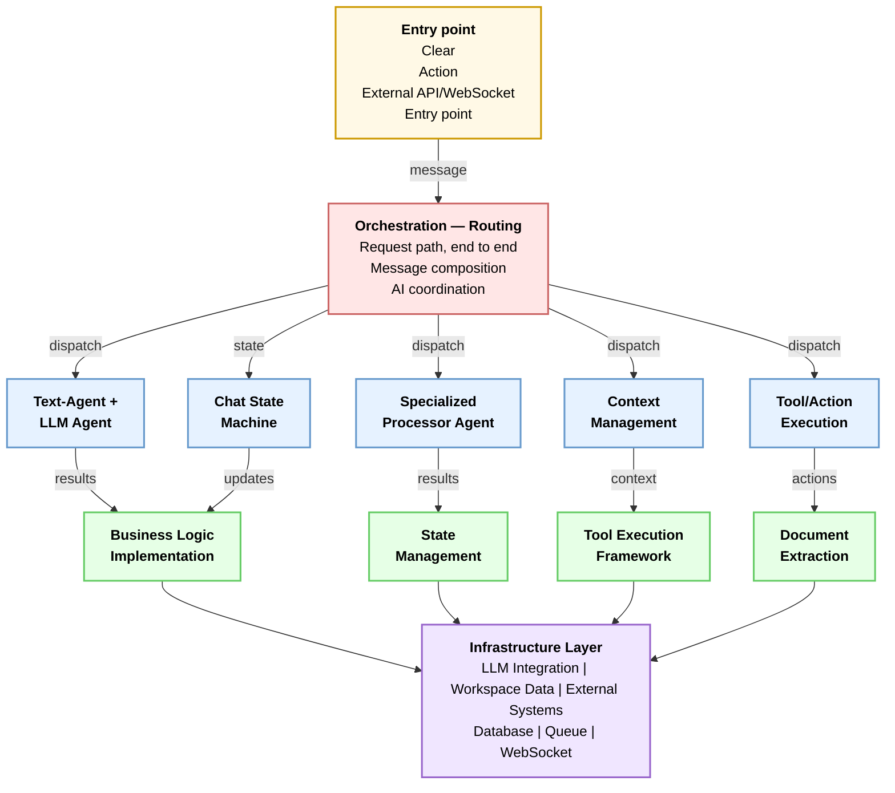

# Ethira Architecture Diagram

## 5-Layer Architecture

## Layer Description

| Layer | Components | Responsibility |
|-------|------------|-----------------|
| **Entry Point** (Yellow) | Clear, Action, External API/WebSocket | User interface entry & message reception |
| **Orchestration** (Pink) | Request routing, Message composition, AI coordination | Route messages to appropriate agents |
| **Agents** (Blue) | Text-Agent, LLM-Agent, Specialized Processor, Context Mgmt, Tool/Action Execution, Chat State Machine | Execute specialized logic & agent tasks |
| **Domain Logic** (Green) | Business Logic, State Management, Tool Execution Framework, Document Extraction | Apply business rules & process data |
| **Infrastructure** (Purple) | LLM Integration, Workspace Data, Database, Queue, WebSocket | Persistence & external system integration |
