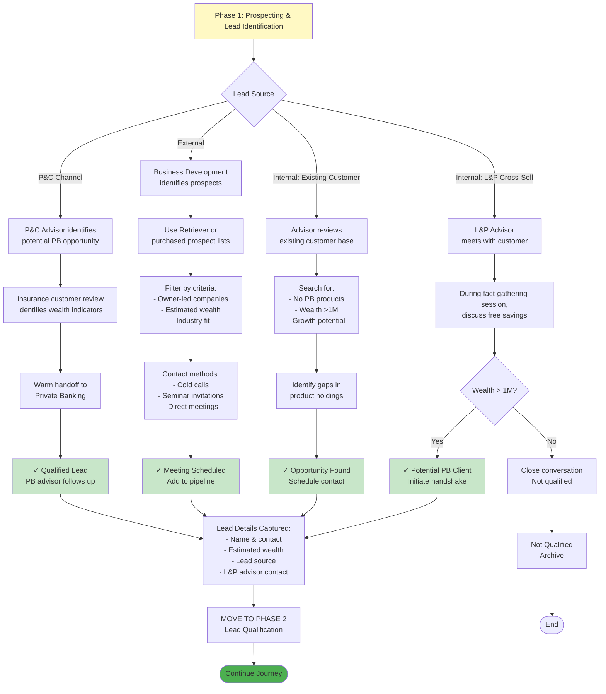
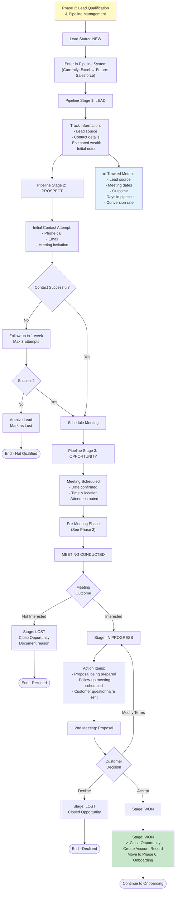
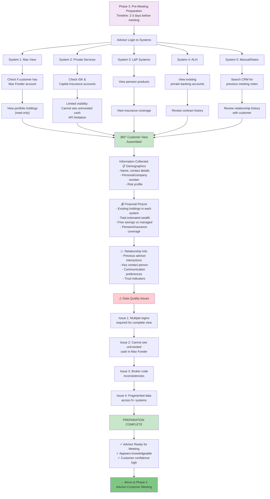
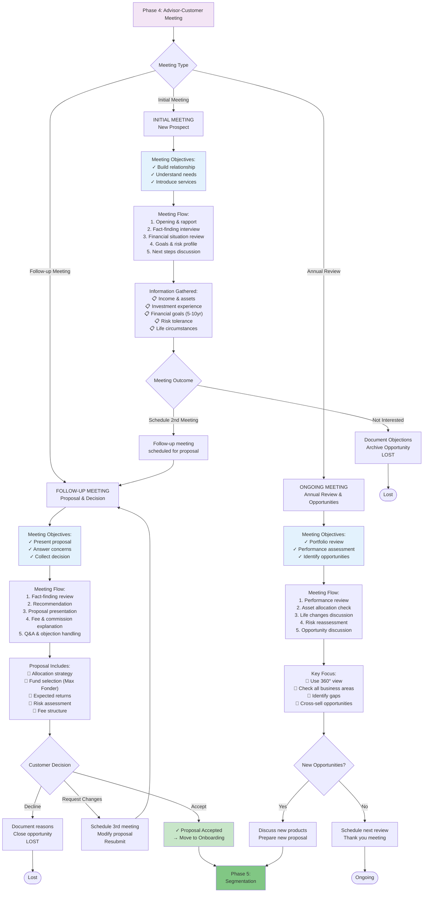
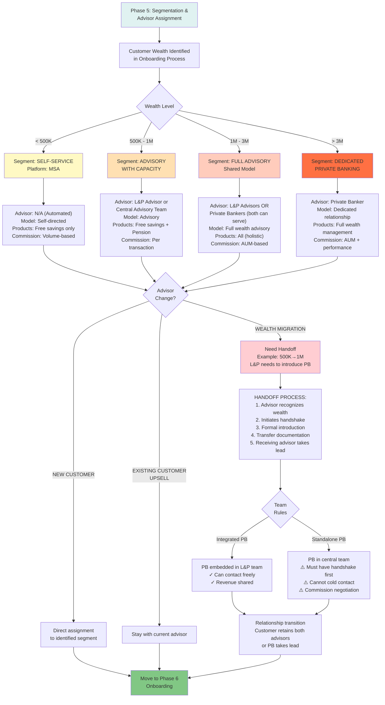
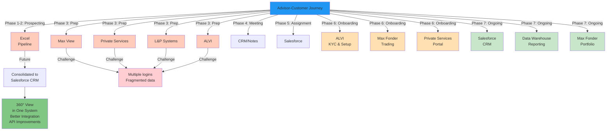

---
categories:
  - "[[Areas]]"
domain: clients
created: 2026-06-23
---
# Advisor-Customer Journey - Mermaid Diagrams

## 1. HIGH-LEVEL OVERVIEW - Complete Journey

```mermaid
graph TD
    Start([Customer/Prospect]) --> Discovery[Phase 1: Prospecting & Lead Identification]

    Discovery --> DiscoveryOptions{Lead Source}
    DiscoveryOptions -->|Internal Cross-Sell| LPAdvisor["L&P Advisor identifies<br/>customer with wealth >1M"]
    DiscoveryOptions -->|External Prospecting| ExtProspect["Business Dev sources<br/>external prospects"]
    DiscoveryOptions -->|Existing Customer| Review["Advisor reviews existing<br/>customer base"]

    LPAdvisor --> Qualify[Phase 2: Lead Qualification & Pipeline]
    ExtProspect --> Qualify
    Review --> Qualify

    Qualify --> QualifyProcess["Track in Excel/Salesforce<br/>Pipeline stages:<br/>Lead → Prospect → Opportunity<br/>→ In Progress → Won"]
    QualifyProcess --> Decision1{Qualified?}
    Decision1 -->|No| Reject["Close Opportunity<br/>Mark as Lost"]
    Decision1 -->|Yes| Prepare[Phase 3: Pre-Meeting Preparation]

    Prepare --> PrepareDetails["Assemble 360° view:<br/>- Customer profile<br/>- Holdings across systems<br/>- Relationship history<br/>- Risk profile"]
    PrepareDetails --> Meeting[Phase 4: Advisor-Customer Meeting]

    Meeting --> MeetingType{Meeting Type}
    MeetingType -->|Initial| Initial["Needs assessment<br/>Fact gathering<br/>Service introduction"]
    MeetingType -->|Follow-up| FollowUp["Present proposal<br/>Q&A and concerns<br/>Decision collection"]
    MeetingType -->|Annual Review| Review2["Portfolio review<br/>Identify opportunities<br/>Rebalancing"]

    Initial --> Decision2{Interest?}
    FollowUp --> Decision2
    Review2 --> Decision3{Action Needed?}

    Decision2 -->|Not Interested| Reject
    Decision2 -->|Yes| Segment[Phase 5: Segmentation &<br/>Advisor Assignment]
    Decision3 -->|New Product| Segment
    Decision3 -->|Increase Amount| Onboard[Phase 6: Onboarding/Setup]

    Segment --> SegmentTypes["Wealth Level:<br/><500K: MSA Platform<br/>500K-1M: L&P/CRT<br/>1-3M: L&P or PB<br/>3M+: Private Banker"]
    SegmentTypes --> Handoff{Advisor Change?}
    Handoff -->|Yes| Coordination["Formal handshake<br/>between teams"]
    Handoff -->|No| Onboard

    Coordination --> Onboard

    Onboard --> OnboardProcess["Phase 6: Onboarding<br/>- KYC verification in ALVI<br/>- Account setup<br/>- Investment proposal<br/>- Execute orders<br/>- Portal access setup"]
    OnboardProcess --> Confirm["Customer Onboarded<br/>Account Active"]

    Confirm --> Ongoing[Phase 7: Ongoing Relationship<br/>Management]

    Ongoing --> OngoingActivities["- Portfolio reviews<br/>- Annual meetings<br/>- 360° view monitoring<br/>- Cross-sell identification<br/>- Warm referrals"]
    OngoingActivities --> Growth["Customer Lifetime Value<br/>Growth & Retention"]

    Reject --> End1([Lost Lead])
    Growth --> End2([Active Customer])

    style Start fill:#e1f5ff
    style Discovery fill:#fff9c4
    style Qualify fill:#fff9c4
    style Prepare fill:#f3e5f5
    style Meeting fill:#f3e5f5
    style Segment fill:#e0f2f1
    style Onboard fill:#ffe0b2
    style Ongoing fill:#c8e6c9
    style End1 fill:#ffcdd2
    style End2 fill:#c8e6c9
```

---

## 2. DETAILED - PROSPECTING & LEAD IDENTIFICATION (Phase 1)

---

## 3. DETAILED - LEAD QUALIFICATION & PIPELINE (Phase 2)

---

## 4. DETAILED - PRE-MEETING PREPARATION (Phase 3)

---

## 5. DETAILED - ADVISOR-CUSTOMER MEETING (Phase 4)

---

## 6. DETAILED - SEGMENTATION & ADVISOR ASSIGNMENT (Phase 5)

---

## 7. DETAILED - ONBOARDING (Phase 6)

```mermaid
graph TD
    A["Phase 6: Onboarding & Account Setup"] --> B["Proposal Accepted<br/>Customer Ready to Open Account"]

    B --> C["Step 1: KYC & Compliance<br/>Location: ALVI System"]
    C --> C1["Collect Documentation:<br/>📄 Government ID<br/>📄 Proof of address<br/>📄 Source of funds<br/>📄 Tax information"]
    C1 --> C2["Verification Process:<br/>✓ Identity verification<br/>✓ Beneficial ownership<br/>✓ PEP screening<br/>✓ Sanctions check"]
    C2 --> C3["✓ KYC APPROVED"]

    C3 --> D["Step 2: Account Creation<br/>Location: ALVI System"]
    D --> D1["Create Primary Account:<br/>- Account type selection<br/>- Currency preference<br/>- Discretionary mandate setup<br/>- Initial deposit info"]
    D1 --> D2["Link to Systems:<br/>- Connect to Max Fonder<br/>- Enable trading access<br/>- Set permissions"]
    D2 --> D3["✓ ACCOUNT CREATED"]

    D3 --> E["Step 3: Investment Setup<br/>Location: ALVI + Max Fonder"]
    E --> E1["Review Investment Proposal:<br/>🎯 Fund allocation %<br/>🎯 Max Fonder fund selection<br/>🎯 Risk level<br/>🎯 Expected returns<br/>🎯 Management fees"]
    E1 --> E2["Execute Orders:<br/>- Buy mutual funds<br/>- Set up discretionary mandate<br/>- Transfer existing investments<br/>- Configure auto-rebalancing"]
    E2 --> E3["✓ ORDERS EXECUTED"]

    E3 --> F["Step 4: Portal Access<br/>Location: Private Services"]
    F --> F1["Set Up Customer Portal:<br/>🔑 Bank ID login enabled<br/>🔑 Two-factor auth configured<br/>🔑 Account access granted"]
    F1 --> F2["Permissions:<br/>- View account holdings<br/>- See transaction history<br/>- View performance reports<br/>- Optional: auto-trading setup"]
    F2 --> F3["✓ PORTAL ACCESS ENABLED"]

    F3 --> G["Step 5: Documentation & Agreements"]
    G --> G1["Customer Review & Sign:<br/>📋 Account agreement<br/>📋 Fund prospectus<br/>📋 Risk disclosure<br/>📋 Fee agreement"]
    G1 --> G2["Advisor delivers:<br/>- Digital via Private Services<br/>- Paper copies<br/>- Signature collection"]
    G2 --> G3["✓ ALL AGREEMENTS SIGNED"]

    G3 --> H["Step 6: Account Activation"]
    H --> H1["Final Checks:<br/>✓ All documents complete<br/>✓ Funds received<br/>✓ Orders confirmed<br/>✓ Access verified"]
    H1 --> H2["Send Welcome Package:<br/>📧 Welcome email<br/>📧 Account summary<br/>📧 Access instructions<br/>📧 First report"]
    H2 --> H3["✓ ACCOUNT LIVE"]

    H3 --> I["✓✓✓ ONBOARDING COMPLETE ✓✓✓"]
    I --> J["Move to Phase 7<br/>Ongoing Relationship Management"]

    J --> END["🎉 Customer Active<br/>Ready for Portfolio Management"]

    style A fill:#ffe0b2
    style C3 fill:#c8e6c9
    style D3 fill:#c8e6c9
    style E3 fill:#c8e6c9
    style F3 fill:#c8e6c9
    style G3 fill:#c8e6c9
    style H3 fill:#c8e6c9
    style I fill:#4caf50
    style END fill:#81c784
```

---

## 8. DETAILED - ONGOING RELATIONSHIP MANAGEMENT (Phase 7)

```mermaid
graph TD
    A["Phase 7: Ongoing Relationship<br/>Management"] --> B["Customer Account Active<br/>Relationship Begins"]

    B --> C["Primary Focus: 360° View<br/>& Opportunity Management"]

    C --> D["Activity 1: Regular Contact"]
    D --> D1["Monthly/Quarterly:<br/>- Portfolio performance updates<br/>- Market commentary<br/>- Opportunity alerts<br/>- Product changes"]
    D1 --> D2["Channel:<br/>📧 Email updates<br/>📞 Phone check-ins<br/>📊 Portal notifications<br/>📋 Periodic reports"]

    C --> E["Activity 2: Portfolio Reviews"]
    E --> E1["Quarterly Reviews:<br/>- Asset allocation check<br/>- Rebalancing assessment<br/>- Performance vs. benchmark<br/>- Risk profile assessment"]
    E1 --> E2["Annual Deep Review:<br/>- Life changes discussion<br/>- Goal progress update<br/>- Tax planning review<br/>- Strategy adjustment"]

    C --> F["Activity 3: 360° View Monitoring"]
    F --> F1["Check Holdings Across<br/>All Business Areas:"]
    F1 --> F2["✓ Private Banking accounts<br/>✓ L&P pension products<br/>✓ Insurance coverage<br/>✓ Free savings in other systems<br/>✓ External investments"]
    F2 --> F3["Identify Gaps:<br/>⚠️ Missing product areas<br/>⚠️ Underutilized funds<br/>⚠️ Coverage gaps<br/>⚠️ Tax inefficiencies"]

    F3 --> G["Activity 4: Cross-Sell<br/>Opportunities"]
    G --> G1["Identify Opportunities:<br/>💼 New private banking products<br/>💼 Insurance products (via P&C)<br/>💼 Pension optimization<br/>💼 Tax strategies"]
    G1 --> G2["Approach Options:<br/>Approach 1️⃣: Advisor advises directly<br/>Approach 2️⃣: Warm referral to specialist<br/>Approach 3️⃣: Colleague introduction<br/>Approach 4️⃣: No action (customer not interested)"]

    G2 --> G3["Track Outcomes:<br/>📊 Opportunities identified<br/>📊 Actions recommended<br/>📊 Customer acceptance rate<br/>📊 New products added"]

    G3 --> H["Activity 5: Commission &<br/>Performance Tracking"]
    H --> H1["Advisor Metrics:<br/>💰 AUM per customer<br/>💰 Commission earned<br/>💰 Cross-sell rate<br/>💰 Customer retention"]
    H1 --> H2["Team Metrics:<br/>📈 Portfolio growth<br/>📈 Lead generation<br/>📈 Conversion rates<br/>📈 Customer lifetime value"]

    H2 --> I["Activity 6: Relationship<br/>Quality Management"]
    I --> I1["Maintain Trust:<br/>✓ Regular communication<br/>✓ Transparent advice<br/>✓ Conflict avoidance<br/>✓ Reliability"]
    I1 --> I2["Build Loyalty:<br/>🤝 VIP treatment for large clients<br/>🤝 Event invitations<br/>🤝 Priority access<br/>🤝 Personalized service"]

    I2 --> J["Life Cycle Events"]

    J --> J1{Trigger Event}
    J1 -->|Customer Wealthy| J2["Upsell: More sophisticated<br/>products, dedicated service"]
    J1 -->|Life Change| J3["Reassess: Update goals,<br/>strategy, products"]
    J1 -->|Market Change| J4["Review: Risk profile,<br/>asset allocation, tax impact"]
    J1 -->|Time Elapsed| J5["Annual Review:<br/>Standard check-in cycle"]

    J2 --> K["Generate Action"]
    J3 --> K
    J4 --> K
    J5 --> K

    K --> L{Action<br/>Needed?}
    L -->|Portfolio Adjustment| M["Execute rebalancing<br/>Update allocation"]
    L -->|New Product| N["Proposal development<br/>New opportunity"]
    L -->|No Change| O["Continue monitoring<br/>Schedule next review"]

    M --> P["ONGOING CYCLE<br/>Continuous Management"]
    N --> P
    O --> P

    P --> Q["🔄 REPEAT:<br/>Regular contact,<br/>Portfolio monitoring,<br/>Opportunity identification,<br/>Commission growth"]

    Q --> R{Customer<br/>Outcome}
    R -->|Active| S["✓ Retained Customer<br/>Growing relationship"]
    R -->|Churned| T["✗ Lost Customer<br/>Investigate reason"]
    R -->|Migrated| U["↗️ Moved to higher segment<br/>More dedicated service"]

    S --> END1["📈 Long-term Value"]
    T --> END2["📉 Learning opportunity"]
    U --> END3["🚀 Growth opportunity"]

    style A fill:#c8e6c9
    style C fill:#81c784
    style D fill:#e3f2fd
    style E fill:#e3f2fd
    style F fill:#e3f2fd
    style G fill:#fff9c4
    style H fill:#ffe0b2
    style P fill:#c8e6c9
    style END1 fill:#4caf50
```

---

## 9. TIMELINE VISUALIZATION - Complete Customer Journey Duration

```mermaid
graph LR
    subgraph "Phase 1: Discovery (1-2 weeks)"
        A["Lead<br/>Identified"]
    end

    subgraph "Phase 2: Qualification (1-3 weeks)"
        B["Prospect<br/>Contact"]
        C["Meeting<br/>Scheduled"]
    end

    subgraph "Phase 3: Preparation (2-3 days before meeting)"
        D["360° View<br/>Assembled"]
    end

    subgraph "Phase 4: Meeting (1-2 weeks)"
        E["Initial<br/>Meeting"]
        F["Proposal<br/>Meeting"]
    end

    subgraph "Phase 5: Segmentation (1-2 days)"
        G["Advisor<br/>Assignment"]
    end

    subgraph "Phase 6: Onboarding (1-2 weeks)"
        H["KYC &<br/>Setup"]
        I["Account<br/>Live"]
    end

    subgraph "Phase 7: Ongoing (Annual)"
        J["Reviews &<br/>Monitoring"]
    end

    A --> B --> C --> D --> E --> F --> G --> H --> I --> J

    style A fill:#fff9c4
    style B fill:#fff9c4
    style C fill:#fff9c4
    style D fill:#f3e5f5
    style E fill:#f3e5f5
    style F fill:#f3e5f5
    style G fill:#e0f2f1
    style H fill:#ffe0b2
    style I fill:#ffe0b2
    style J fill:#c8e6c9
```

---

## 10. SYSTEM INTERACTIONS DURING JOURNEY

