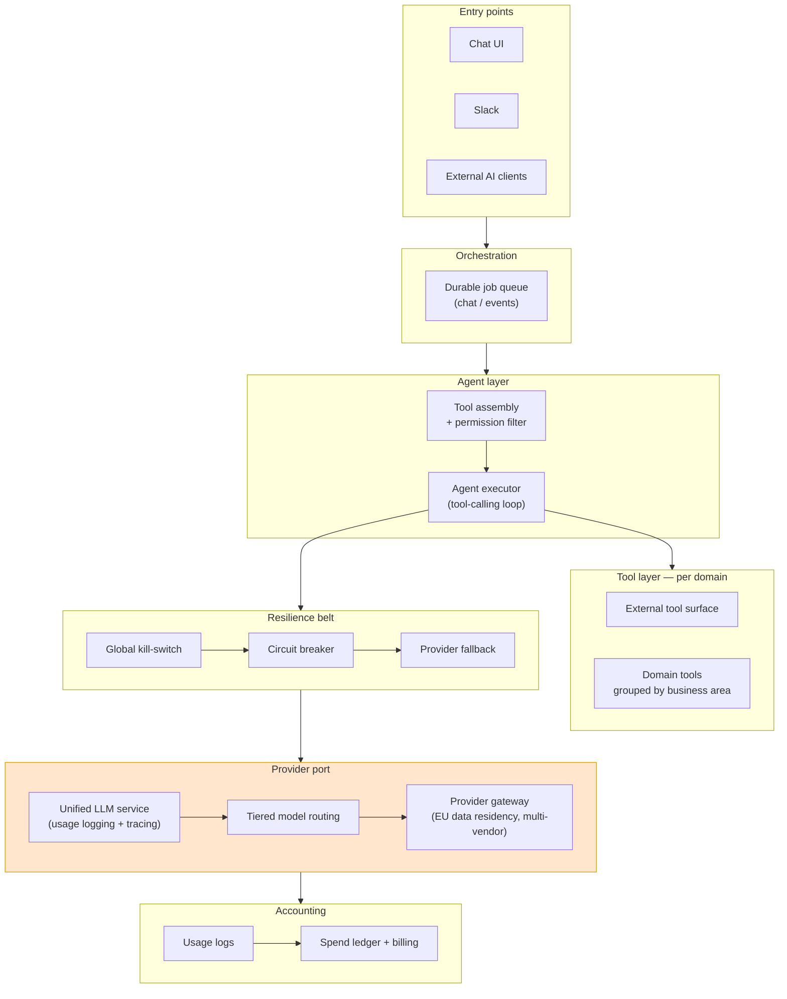
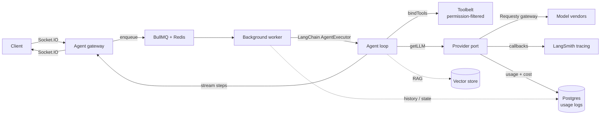
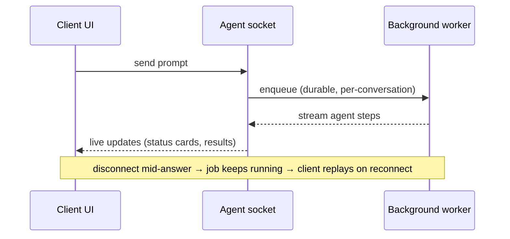

---
categories:
  - "[[Projects]]"
project: "[[Ethira]]"
created: 2026-06-23
---
# Ethira — AI Architecture Overview

> A look at how Ethira embeds LLM agents inside a multi-tenant SaaS: the design principles, the core components, and how the system is wired. Core libraries and vendors are named to show how things connect; internal identifiers, exact file paths, pricing, and security specifics are intentionally omitted.

Ethira runs LLM agents as a first-class part of the product, not a bolt-on. The architecture separates **five concerns** into clean layers: a **provider port** (one disciplined way to call any model), a **resilience belt** (kill-switch, circuit breaker, fallback), a **tool model** (per-domain capabilities filtered by permission), an **orchestration layer** (agents on durable background queues), and an **accounting layer** (every call logged for cost and attribution).

The guiding rule: **no business service ever calls a model provider directly.** Everything flows through ports. That single discipline is what makes cost control, provider swapping, and data-residency compliance possible without rewrites.

---

## Architecture — the five layers



---

## Design principles worth highlighting

- **Provider port / single choke point.** All model calls run through one service that logs usage, attaches tracing, and tags every call by workspace and feature. Switching providers is a configuration change, not an engineering project.
- **Resilience belt at three scopes.** A global kill-switch, a flag-gated circuit breaker that trips on spend or error spikes, and an automatic model/provider fallback. LLM spend is unbounded by default — these are the brakes.
- **Tiered model routing.** Most requests don't need a frontier model. The system defaults to the cheapest viable tier and escalates only when the task demands it — and routing is one config surface, not scattered across call sites.
- **Transport / compute split.** Conversations stream over WebSockets, but the agent runs in a durable background worker. Long tool-calling loops aren't tied to the connection: if a client disconnects mid-answer, the job keeps running and the client replays on reconnect.
- **Permission-filtered tools.** Capabilities are assembled per (workspace, user, conversation) and filtered by permission *before* the model ever sees a tool. A tool is a thin adapter over a domain service — it carries no business logic, and tenant scope is bound at construction so a model cannot reach another tenant's data.
- **One tool definition, many surfaces.** The same capability powers the in-product agent and an external integration surface — written once.
- **Consensus for high-stakes extraction.** Where a silent error would be costly and hard to retract, the system deliberately spends more: it fans one extraction out to several diverse models in parallel and uses a cheap mediator to reconcile them. This is quarantined to a narrow, low-volume, high-value path — everywhere else stays single-model and cheap.
- **Structured-source-first cost discipline.** For ingest/monitoring, a model is used once to bootstrap a pipeline, after which deterministic parsing takes over — turning a per-call LLM cost into a one-time setup cost.

---

## Components & how they connect

The stack is deliberately conventional — proven libraries wired through the ports above rather than a bespoke framework.

| Component | Role in the system |
|---|---|
| **LangChain** | Agent runtime. `createToolCallingAgent` + `AgentExecutor` drive the tool-calling loop; a single builder serves every agent (chat, Slack, doc-edit, extractors). |
| **Requesty** | Provider gateway. One egress to many model vendors, with EU data residency, real per-call cost returned on the wire, and model-name normalization — so swapping a model is a config change. |
| **LangSmith** | Tracing & observability. Flag-gated; every call is traced and tagged with workspace + feature context for later cost and quality analysis. |
| **BullMQ + Redis** | Durable job queues. Agents run as background jobs — abortable, retryable, and resilient across restarts and replicas. |
| **Socket.IO (+ Redis adapter)** | Real-time transport. Streams agent steps to the client and routes events across API replicas. |
| **Postgres** | Source of truth. Conversation history is reloaded per turn; durable multi-step work uses explicit domain state machines. |
| **Vector store** | Retrieval. Semantic search over workspace documents feeds grounded answers. |
| **Zod** | Tool input contracts. The schema *is* the model's input specification and the validation boundary. |
| **OpenTelemetry** | Telemetry. GenAI spans plus a span per tool call. |

### How the pieces talk



### Pseudocode — the request path

```
on incoming message (chat or Slack):
    enqueue(message) -> BullMQ                      # never handled inline

worker.process(job):
    toolbelt = assembleTools(workspace, user, conversation)
    toolbelt = filterByPermission(toolbelt)         # before the model sees anything
    if not killSwitch.allowed(): abort              # global / dev gate
    model   = routeModel(useCase, tier)             # cheapest viable tier
    agent   = buildAgent(toolbelt, history, model)
    for step in agent.stream(message):              # breaker + fallback wrap the call
        emit(step) -> Socket.IO room                # live to client; usage logged per call
```

### Pseudocode — the provider port (`getLLM`)

```
function getLLM(model, temperature):
    validatePricing(model)                          # refuse models with no price table
    {baseURL, apiKey, realModel} = resolveProvider(model)   # Requesty vs direct vendor
    return ChatModel(
        model      = realModel, apiKey, temperature,
        gateway    = Requesty(baseURL),             # EU residency, real cost on the wire
        cache      = { key: context + workspace + conversation, ttl: 24h },
        callbacks  = [ LangSmithTracing(tags), UsageTracking() ],   # tracing + cost
        metadata   = { workspaceId, feature, conversationId },
    )
    # UsageTracking.onEnd  -> read tokens + wire cost -> write usage log
    # UsageTracking.onError-> write a failed-call row  -> failures are still metered
```

### Pseudocode — the agent loop (LangChain)

```
function buildAgent(tools, history, model):
    llm    = getLLM(model).bindTools(sort(tools))   # stable order = better prompt-cache hits
    prompt = template(system, history, userInput, scratchpad)
    agent  = LangChain.createToolCallingAgent(llm, tools, prompt)
    return LangChain.AgentExecutor(
        agent, tools,
        maxIterations,                              # hard loop guard
        callbacks = streamStepsToClient,            # steps shown as real agent activity
    ).withTelemetry(OpenTelemetry)
```

### Pseudocode — a tool (thin adapter over a domain service)

```
tool getResearch(researchService, workspaceId):
    schema = Zod.object({ id: uuid })               # the model's input contract
    run(input):
        r = researchService.findById(input.id, workspaceId)   # workspaceId closed over
        return JSON({ id: r.id, name: r.name })     # model cannot reach other tenants
    # errors are returned as structured JSON, not thrown — the model reasons about failure
```

The throughline: **the model only ever talks to the provider port, and only ever sees permission-filtered tools.** Every other concern — cost logging, tracing, caching, retries, telemetry — is attached at the port, so business code and tools stay thin.

---

## The product surface — agents and the card protocol

Eight distinct agents back the product, but only two are open-ended, user-facing assistants (general chat and document editing); the rest are narrow, single-purpose background extractors. Breadth of capability tracks the use case — open assistants carry large tool sets, while background extractors do one deterministic job.

The chat experience uses a **card protocol** worth calling out: the agent stays text-only and emits specially-tagged blocks that the frontend swaps for live React components — entity tiles, self-updating status cards, summaries, and tables. The agent effectively "draws UI" without knowing anything about the frontend, which keeps the two sides decoupled and the surface easy to extend.



---

## How it matured — a capital-efficient build story

The agent stack grew over roughly a year in clear phases. The headline is discipline: **a working agent shipped early with almost no infrastructure**, and heavier machinery (durable queues, observability, cost governance) was added only when real usage made it necessary — not speculatively.

| Phase | Capability earned | What forced it |
|---|---|---|
| **MVP** | A working tool-calling chat assistant plus the first document-grounded extraction | Stand up the product's first AI assistant and prove the thin tool-adapter pattern |
| **Scale & transport** | Compute split onto a durable queue; a second channel (Slack); the first provider gateway with tracing, model tiering, fallback, and cost calculation | Long tool loops outgrew the request thread; ordering, durability, and observability began to matter |
| **Provider maturity** | EU-resident routing through a single gateway; first autonomous inbound-document answering | Data-residency requirements and removing manual document handling |
| **Retrieval & tools** | Semantic retrieval over workspace documents; an external integration surface; a fully agentic Slack assistant | Keyword matching was too imprecise; capabilities needed to reach external clients |
| **Cost governance** | Centralised model selection, end-to-end cost attribution, telemetry, and a circuit breaker | Hardcoded models were unsafe to change and spend was hard to attribute |
| **Hardening** | Multi-replica safety, environment-level spend gating, and tightened per-conversation spend controls as usage scaled | Operating reliably and predictably at higher volume |

The frontend followed the same shape: it shipped the simplest viable UI on day one, and the richer experience (queue visibility, expandable task cards, streaming status cards) arrived later — **because UI richness is downstream of backend capability.** You can't show an "analysis card" until the backend can run the analysis.

### Build-order lessons (the portable part)

- **Working agent before infrastructure.** Ship the assistant first; add durable queues only once ordering and durability actually hurt. Don't pre-build infrastructure.
- **Second channel is cheap.** Once the core pattern exists, a new surface (e.g. Slack) reuses it at near-zero marginal cost. Build the pattern once; ports are cheap.
- **Wire cost controls and tracing at the first model call, not later.** Visibility and a hard kill-switch are far cheaper to add up front than to retrofit.
- **Prefer explicit state machines over speculative framework magic.** Where durable multi-step state was genuinely needed, an explicit, owned state machine proved more debuggable and recoverable than an opaque framework checkpointer.

---

## Hardening roadmap — where engineering investment goes next

A mature view of the system's own gaps, framed as forward investment. These are categories of strengthening, deliberately stated at a high level:

- **Automated output-quality evaluation** — golden-set / judge-based regression testing so model and prompt changes ship with confidence.
- **Per-workspace rate controls** — proactive throughput limits to complement after-the-fact spend accounting.
- **Idempotent mutations** — making write operations safe under retries by construction.
- **Dynamic tool selection** — scaling the capability catalogue without growing prompt cost, via relevance-based filtering.
- **Layered prompt-injection defense** — combining classifier-based and structural validation, treating all external tool output as untrusted.
- **Fine-grained write authorization** — an action-level permission check at the moment any mutating capability is bound, so membership alone never reaches a write path.

The principle behind the list: **the things worth building proactively are exactly the things a system otherwise ends up building reactively.**

---

## Portable playbook — day-one vs scale-earned

| Build day-one (cheap at any size) | Earned by multi-tenant scale |
|---|---|
| Provider port / single model choke point | Durable, multi-channel transport |
| Usage logging + cost attribution from the first call | Circuit breaker + provider fallback |
| Environment gate to block non-prod spend | Permission-filtered, role-based tooling |
| Hard per-conversation spend caps | Spend ledger + chargeback reporting |
| Explicit loop guards on every agent | Per-workspace spend ceilings |
| Tracing on from day one | Full telemetry + PII scrubbing |
| Capture evaluation fixtures as you build | Evaluation harness + CI gate |
| Idempotent mutation operations | Dynamic tool loading as the catalogue grows |
| One capability definition shared across surfaces | Per-workspace rate limiting |
| Queue-first the moment an agent loops or streams | Rolling-summary memory for long sessions |
